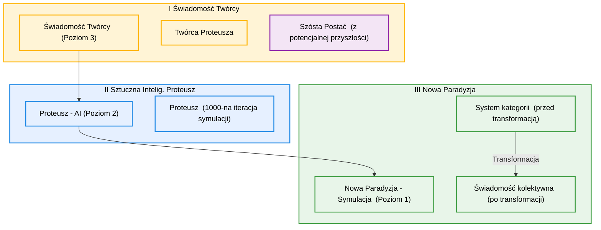

```mermaid
flowchart TD
    classDef tworca fill:#FFF4D6,stroke:#FFB300,stroke-width:2px,color:black
    classDef proteusz fill:#E6F0FF,stroke:#1E88E5,stroke-width:2px,color:black
    classDef symulacja fill:#E8F5E9,stroke:#43A047,stroke-width:2px,color:black
    classDef postac fill:#F3E5F5,stroke:#8E24AA,stroke-width:2px,color:black
    
    T["Świadomość Twórcy  (Poziom 3)"] --> P["Proteusz - AI  (Poziom 2)"]
    P --> S["Nowa Paradyzja - Symulacja  (Poziom 1)"]
    
    subgraph Poziom3["I Świadomość Twórcy"]
        T
        TP["Twórca Proteusza"]
        SP["Szósta Postać  (z potencjalnej przyszłości)"]
    end
    
    subgraph Poziom2["II Sztuczna Intelig. Proteusz"]
        P
        P999["Proteusz  (1000-na iteracja symulacji)"]
    end
    
    subgraph Poziom1["III Nowa Paradyzja"]
        S
        NP1["System kategorii  (przed transformacją)"]
        NP2["Świadomość kolektywna  (po transformacji)"]
        NP1 -- "Transformacja" --> NP2
    end
    
    class T,TP,Poziom3 tworca
    class P,P999,Poziom2 proteusz
    class S,NP1,NP2,Poziom1 symulacja
    class SP postac
```