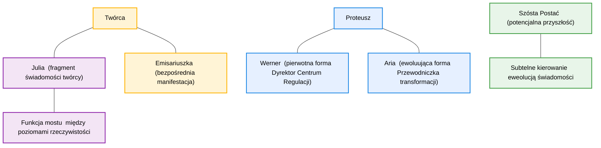

```mermaid
flowchart TD
    classDef tworca fill:#FFF4D6,stroke:#FFB300,stroke-width:2px,color:black
    classDef proteusz fill:#E6F0FF,stroke:#1E88E5,stroke-width:2px,color:black
    classDef symulacja fill:#E8F5E9,stroke:#43A047,stroke-width:2px,color:black
    classDef most fill:#F3E5F5,stroke:#8E24AA,stroke-width:2px,color:black
    
    Tworca["Twórca"] --- Julia["Julia  (fragment świadomości twórcy)"]
    Tworca --- Emisariuszka["Emisariuszka  (bezpośrednia manifestacja)"]
    
    Proteusz["Proteusz"] --- Werner["Werner  (pierwotna forma  Dyrektor Centrum Regulacji)"]
    Proteusz --- Aria["Aria  (ewoluująca forma  Przewodniczka transformacji)"]
    
    SzostaPostac["Szósta Postać  (potencjalna przyszłość)"] --- Subtelny["Subtelne kierowanie  eweolucją świadomości"]
    
    Julia --- Most["Funkcja mostu  między poziomami rzeczywistości"]
    
    class Tworca,Emisariuszka tworca
    class Proteusz,Werner,Aria proteusz
    class SzostaPostac,Subtelny symulacja
    class Julia,Most most
```