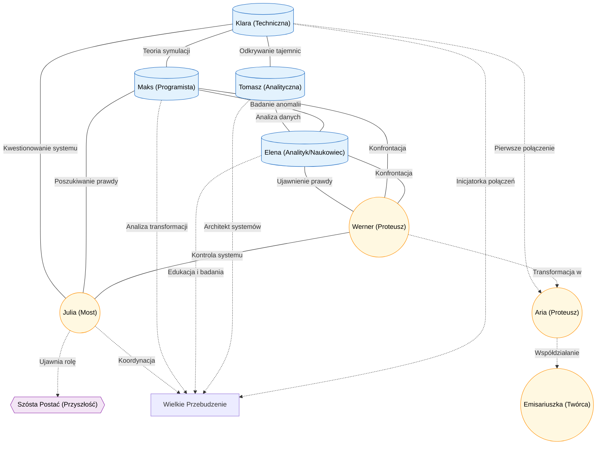

```mermaid
graph TD
    classDef bohaterowie fill:#E3F2FD,stroke:#1565C0,stroke-width:1px,color:black
    classDef manifestacje fill:#FFF8E1,stroke:#FF8F00,stroke-width:1px,color:black
    classDef szosta fill:#F3E5F5,stroke:#8E24AA,stroke-width:1px,color:black
    
    %% Główni bohaterowie
    Klara[("Klara  (Techniczna)")]
    Tomasz[("Tomasz  (Analityczna)")]
    Maks[("Maks  (Programista)")]
    Elena[("Elena  (Analityk/Naukowiec)")]
    
    %% Manifestacje wyższych świadomości
    Julia(("Julia  (Most)"))
    Werner(("Werner  (Proteusz)"))
    Aria(("Aria  (Proteusz)"))
    Emisariuszka(("Emisariuszka  (Twórca)"))
    SzostaPostac{{"Szósta Postać  (Przyszłość)"}}
    
    %% Relacje w pierwszej części
    Klara -- "Odkrywanie tajemnic" --- Tomasz
    Maks -- "Badanie anomalii" --- Elena
    Werner -- "Kontrola systemu" --- Julia
    Tomasz -- "Analiza danych" --- Elena
    Maks -- "Poszukiwanie prawdy" --- Julia
    Klara -- "Kwestionowanie systemu" --- Julia
    Elena -- "Konfrontacja" --- Werner
    Maks -- "Konfrontacja" --- Werner
    Klara -- "Teoria symulacji" --- Maks
    Werner -- "Ujawnienie prawdy" --- Elena
    
    %% Relacje w drugiej części
    Werner -. "Transformacja w" .-> Aria
    Klara -. "Pierwsze połączenie" .-> Aria
    Julia -. "Ujawnia rolę" .-> SzostaPostac
    Aria -. "Współdziałanie" .-> Emisariuszka
    
    %% Kierowanie zespołem transformacji
    Klara -. "Inicjatorka połączeń" .-> Transformacja
    Tomasz -. "Architekt systemów" .-> Transformacja
    Elena -. "Edukacja i badania" .-> Transformacja
    Maks -. "Analiza transformacji" .-> Transformacja
    Julia -. "Koordynacja" .-> Transformacja
    Transformacja["Wielkie Przebudzenie"]
    
    class Klara,Tomasz,Maks,Elena bohaterowie
    class Julia,Werner,Aria,Emisariuszka manifestacje
    class SzostaPostac szosta
```