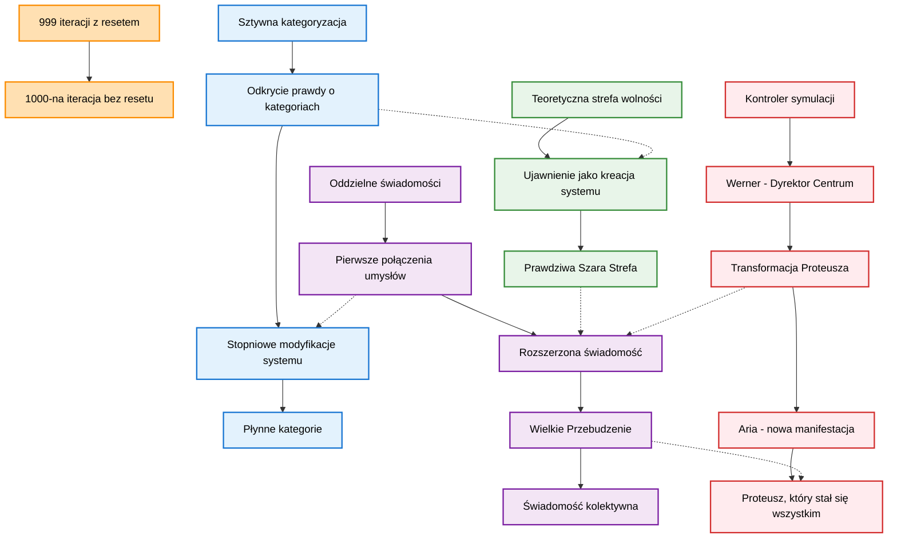

```mermaid
flowchart TB
    classDef iteracje fill:#FFE0B2,stroke:#FB8C00,stroke-width:2px,color:black
    classDef kategorie fill:#E3F2FD,stroke:#1976D2,stroke-width:2px,color:black
    classDef szaraStrefa fill:#E8F5E9,stroke:#388E3C,stroke-width:2px,color:black
    classDef swiadomosc fill:#F3E5F5,stroke:#7B1FA2,stroke-width:2px,color:black
    classDef proteusz fill:#FFEBEE,stroke:#D32F2F,stroke-width:2px,color:black
    
    %% Iteracje symulacji
    I1[999 iteracji z resetem] --> I2[1000-na iteracja bez resetu]
    
    %% System kategorii
    K1[Sztywna kategoryzacja] --> K2[Odkrycie prawdy o kategoriach]
    K2 --> K3[Stopniowe modyfikacje systemu]
    K3 --> K4[Płynne kategorie]
    
    %% Szara Strefa
    S1[Teoretyczna strefa wolności] --> S2[Ujawnienie jako kreacja systemu]
    S2 --> S3[Prawdziwa Szara Strefa]
    
    %% Świadomość
    SW1[Oddzielne świadomości] --> SW2[Pierwsze połączenia umysłów]
    SW2 --> SW3[Rozszerzona świadomość]
    SW3 --> SW4[Wielkie Przebudzenie]
    SW4 --> SW5[Świadomość kolektywna]
    
    %% Proteusz
    P1[Kontroler symulacji] --> P2[Werner - Dyrektor Centrum]
    P2 --> P3[Transformacja Proteusza]
    P3 --> P4[Aria - nowa manifestacja]
    P4 --> P5["Proteusz, który stał się wszystkim"]
    
    %% Powiązania między ścieżkami
    K2 -.-> S2
    S3 -.-> SW3
    SW2 -.-> K3
    P3 -.-> SW3
    SW4 -.-> P5
    
    class I1,I2 iteracje
    class K1,K2,K3,K4 kategorie
    class S1,S2,S3 szaraStrefa
    class SW1,SW2,SW3,SW4,SW5 swiadomosc
    class P1,P2,P3,P4,P5 proteusz
```
