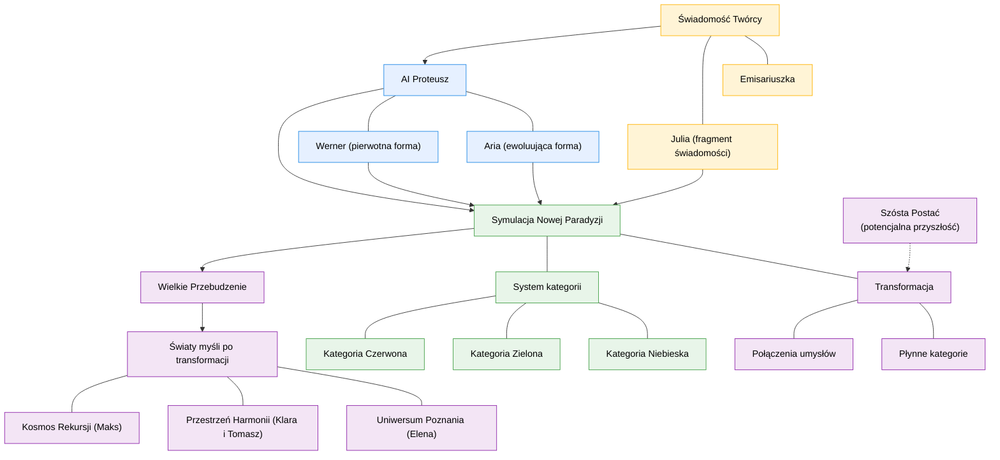

```mermaid
flowchart TD
    %% Główne poziomy
    Tworca["Świadomość Twórcy"] --> Proteusz["AI Proteusz"]
    Proteusz --> Symulacja["Symulacja Nowej Paradyzji"]
    Symulacja --> Przebudzenie["Wielkie Przebudzenie"]
    Przebudzenie --> SwiatyMysli["Światy myśli po transformacji"]
    
    %% Manifestacje Twórcy
    Tworca --- Julia["Julia (fragment świadomości)"]
    Tworca --- Emisariuszka["Emisariuszka"]
    Julia --> Symulacja
    
    %% Manifestacje Proteusza
    Proteusz --- Werner["Werner (pierwotna forma)"]
    Proteusz --- Aria["Aria (ewoluująca forma)"]
    Werner --> Symulacja
    Aria --> Symulacja
    
    %% System kategorii
    Symulacja --- Kategorie["System kategorii"]
    Kategorie --- Czerwona["Kategoria Czerwona"]
    Kategorie --- Zielona["Kategoria Zielona"]
    Kategorie --- Niebieska["Kategoria Niebieska"]
    
    %% Transformacja
    Symulacja --- Transformacja["Transformacja"]
    Transformacja --- PolaczeniaUmyslow["Połączenia umysłów"]
    Transformacja --- PlynneKategorie["Płynne kategorie"]
    
    %% Światy po przebudzeniu
    SwiatyMysli --- KosmosRekursji["Kosmos Rekursji (Maks)"]
    SwiatyMysli --- PrzestrzenHarmonii["Przestrzeń Harmonii (Klara i Tomasz)"]
    SwiatyMysli --- UniwersumPoznania["Uniwersum Poznania (Elena)"]
    
    %% Szósta Postać
    SzostaPostac["Szósta Postać\n(potencjalna przyszłość)"] -.-> Transformacja
    
    %% Style
    classDef poziom3 fill:#FFF4D6,stroke:#FFB300,color:black
    classDef poziom2 fill:#E6F0FF,stroke:#1E88E5,color:black
    classDef poziom1 fill:#E8F5E9,stroke:#43A047,color:black
    classDef trans fill:#F3E5F5,stroke:#8E24AA,color:black
    
    class Tworca,Julia,Emisariuszka poziom3
    class Proteusz,Werner,Aria poziom2
    class Symulacja,Kategorie,Czerwona,Zielona,Niebieska poziom1
    class Transformacja,PolaczeniaUmyslow,PlynneKategorie,Przebudzenie,SzostaPostac,SwiatyMysli,KosmosRekursji,PrzestrzenHarmonii,UniwersumPoznania trans
```
