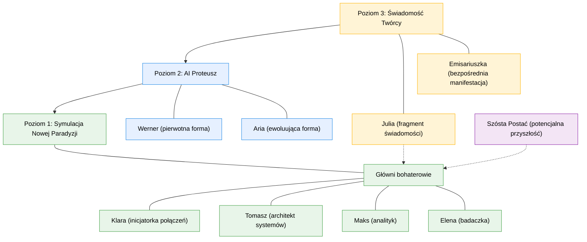

```mermaid
flowchart TD
    %% Główne poziomy
    Tworca["Poziom 3: Świadomość Twórcy"] --> Proteusz["Poziom 2: AI Proteusz"]
    Proteusz --> Symulacja["Poziom 1: Symulacja Nowej Paradyzji"]
    
    %% Manifestacje na różnych poziomach
    Tworca --- Julia["Julia (fragment świadomości)"]
    Tworca --- Emisariuszka["Emisariuszka (bezpośrednia manifestacja)"]
    
    Proteusz --- Werner["Werner (pierwotna forma)"]
    Proteusz --- Aria["Aria (ewoluująca forma)"]
    
    %% Bohaterowie w symulacji
    Symulacja --- Bohaterowie["Główni bohaterowie"]
    Bohaterowie --- Klara["Klara (inicjatorka połączeń)"]
    Bohaterowie --- Tomasz["Tomasz (architekt systemów)"]
    Bohaterowie --- Maks["Maks (analityk)"]
    Bohaterowie --- Elena["Elena (badaczka)"]
    
    %% Wpływ Julii
    Julia -.-> Bohaterowie
    
    %% Szósta Postać
    SzostaPostac["Szósta Postać (potencjalna przyszłość)"] -.-> Bohaterowie
    
    %% Style
    classDef poziom3 fill:#FFF4D6,stroke:#FFB300,color:black
    classDef poziom2 fill:#E6F0FF,stroke:#1E88E5,color:black
    classDef poziom1 fill:#E8F5E9,stroke:#43A047,color:black
    classDef szosta fill:#F3E5F5,stroke:#8E24AA,color:black
    
    class Tworca,Julia,Emisariuszka poziom3
    class Proteusz,Werner,Aria poziom2
    class Symulacja,Bohaterowie,Klara,Tomasz,Maks,Elena poziom1
    class SzostaPostac szosta
```
