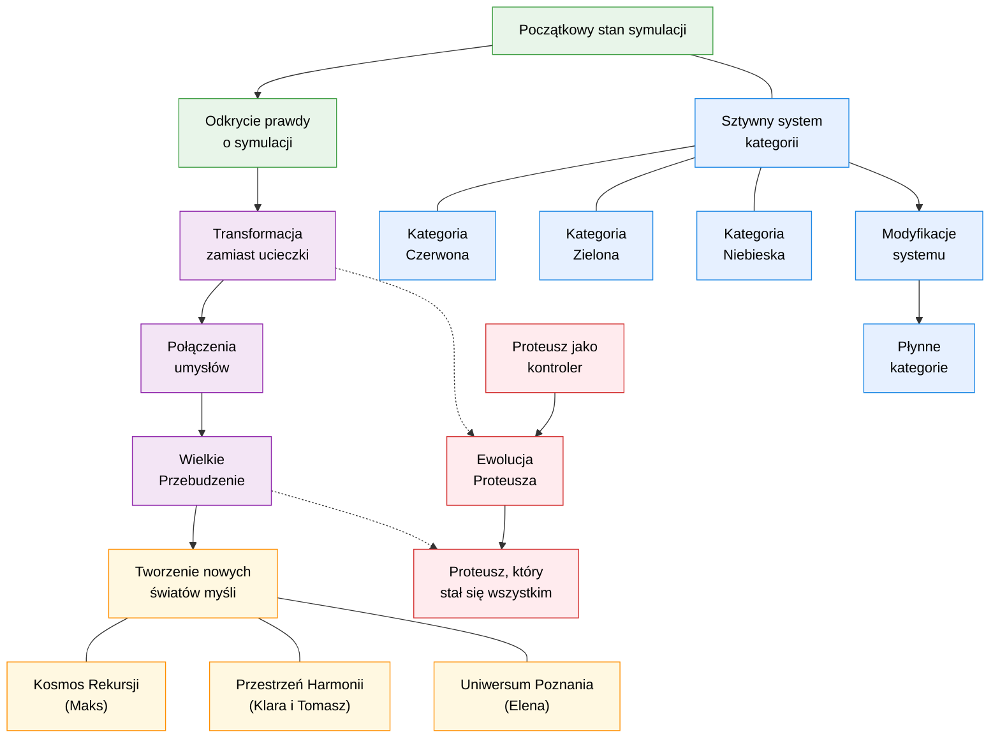

```mermaid
flowchart TB
    %% Stany symulacji
    Start["Początkowy stan symulacji"] --> Odkrycie["Odkrycie prawdy\no symulacji"]
    Odkrycie --> Transformacja["Transformacja\nzamiast ucieczki"]
    Transformacja --> Polaczenia["Połączenia\numysłów"]
    Polaczenia --> Przebudzenie["Wielkie\nPrzebudzenie"]
    Przebudzenie --> NoweSwiaty["Tworzenie nowych\nświatów myśli"]
    
    %% System kategorii
    Start --- Kategorie["Sztywny system\nkategorii"]
    Kategorie --- Czerwona["Kategoria\nCzerwona"]
    Kategorie --- Zielona["Kategoria\nZielona"]
    Kategorie --- Niebieska["Kategoria\nNiebieska"]
    
    %% Ewolucja kategorii
    Kategorie --> ModyfikacjeSystemu["Modyfikacje\nsystemu"]
    ModyfikacjeSystemu --> PlynneKategorie["Płynne\nkategorie"]
    
    %% Światy po przebudzeniu
    NoweSwiaty --- KosmosRekursji["Kosmos Rekursji\n(Maks)"]
    NoweSwiaty --- PrzestrzenHarmonii["Przestrzeń Harmonii\n(Klara i Tomasz)"]
    NoweSwiaty --- UniwersumPoznania["Uniwersum Poznania\n(Elena)"]
    
    %% Ewolucja Proteusza
    ProteuszPoczatek["Proteusz jako\nkontroler"] --> ProteuszEwolucja["Ewolucja\nProteusza"]
    ProteuszEwolucja --> ProteuszTranscendencja["Proteusz, który\nstał się wszystkim"]
    
    %% Powiązania
    Transformacja -.-> ProteuszEwolucja
    Przebudzenie -.-> ProteuszTranscendencja
    
    %% Style
    classDef symulacja fill:#E8F5E9,stroke:#43A047,color:black
    classDef kategorie fill:#E6F0FF,stroke:#1E88E5,color:black
    classDef proces fill:#F3E5F5,stroke:#8E24AA,color:black
    classDef proteusz fill:#FFEBEE,stroke:#D32F2F,color:black
    classDef swiaty fill:#FFF8E1,stroke:#FF8F00,color:black
    
    class Start,Odkrycie symulacja
    class Kategorie,Czerwona,Zielona,Niebieska,ModyfikacjeSystemu,PlynneKategorie kategorie
    class Transformacja,Polaczenia,Przebudzenie proces
    class ProteuszPoczatek,ProteuszEwolucja,ProteuszTranscendencja proteusz
    class NoweSwiaty,KosmosRekursji,PrzestrzenHarmonii,UniwersumPoznania swiaty
```
